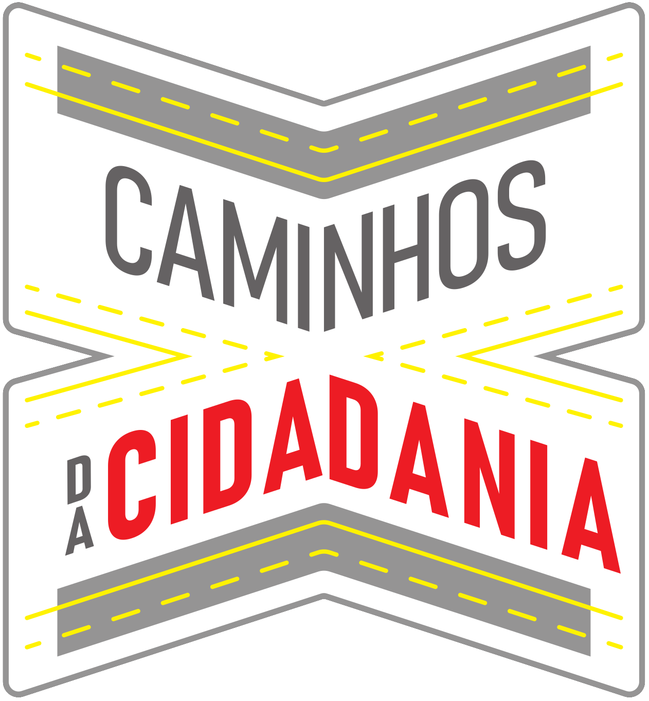
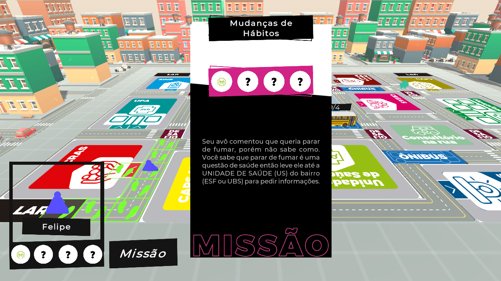
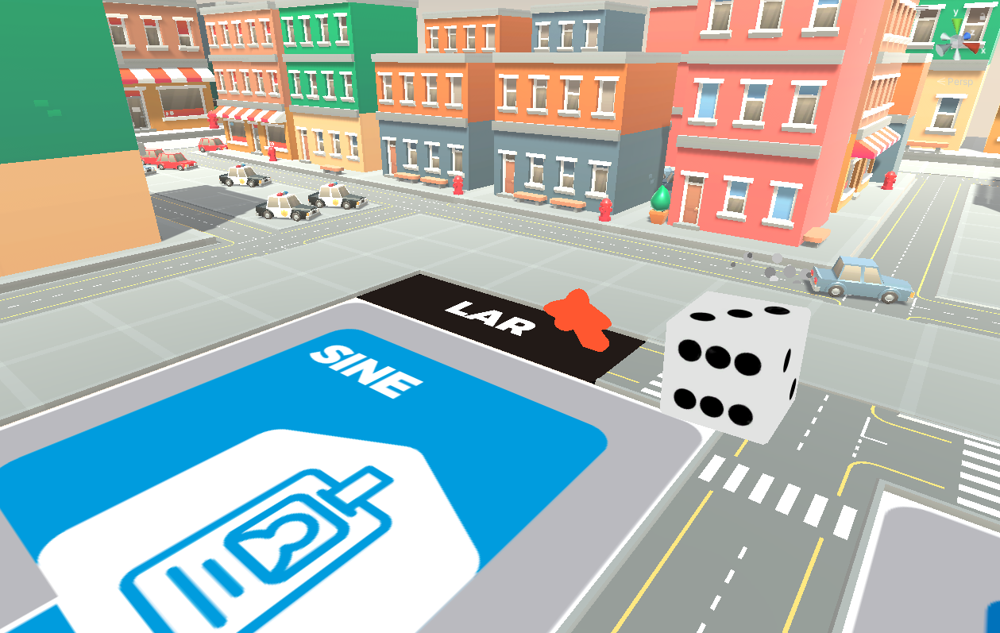
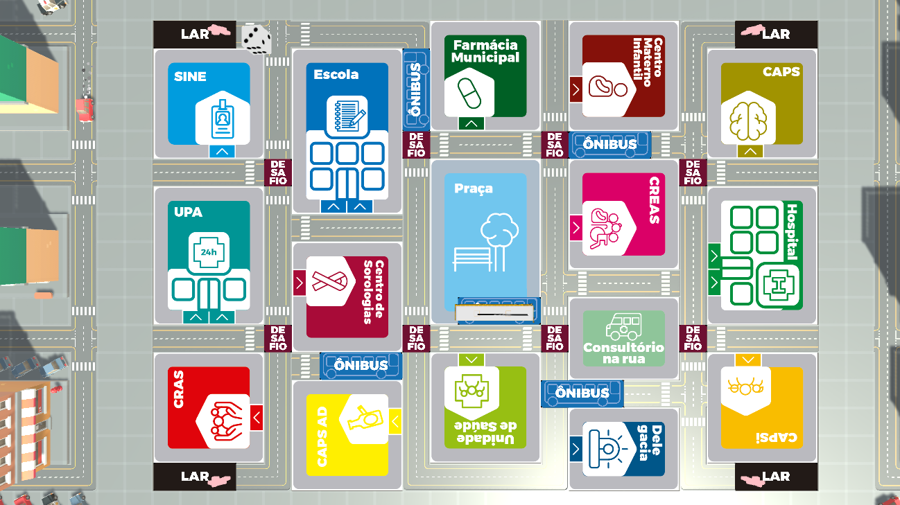

# Caminhos da Cidadania 🎲 🇧🇷

  

**Caminhos da Cidadania** é um jogo digital gratuito de educação em saúde desenvolvido como Trabalho de Conclusão de Curso (TCC) no curso de Jogos Digitais da Universidade do Vale do Rio dos Sinos (UNISINOS), aprovado com distinção.

O projeto é uma adaptação digital do jogo de tabuleiro "Caminhos do SUS", criado pelo GRUPAD (Grupo de Pesquisa sobre Adolescências), com o objetivo de educar alunos da rede pública sobre o funcionamento do Sistema Único de Saúde (SUS) de forma lúdica, acessível e interativa.

> 🎮 [Jogar agora no itch.io](https://igorflores.itch.io/caminhos-da-cidadania)

## 🧠 Objetivo

Promover **educação em saúde pública** por meio da gamificação, reforçando a importância do SUS no cotidiano dos cidadãos, especialmente entre adolescentes em escolas públicas.

## Capturas de Tela

  

  

  

## 🛠️ Tecnologias

- [Unity 3D](https://unity.com/) (versão 2023+)
- C#
- Visual Studio Code
- GIMP (design gráfico)
- Audacity (edição de áudio)
- [Tile Palette](https://docs.unity3d.com/Manual/Tilemap-TilePalette.html)
- Metodologia SCRUM (Notion)

## 🧩 Principais Mecânicas

- 🧭 Missões com objetivos específicos pelo mapa da cidade que acercam os serviços do SUS
- 🎭 Casas de desafio com simulação de situações reais
- 🚌 Ônibus que anda pela cidade para movimentação opcional dos jogadores
- 🎲 "Super Dado" surpresa no final do jogo
- 🎨 Escolha de pinos personalizados em 3D
- 💬 Interações com locais e dicas educativas em tempo real

## 🧪 Testes em Escolas

O jogo foi testado em duas escolas da rede pública de Alvorada (RS), com mais de **25 estudantes** participando e avaliando os elementos gráficos, clareza das informações e intuitividade da gameplay.

## 🎓 Créditos

- **Desenvolvimento**: Igor Flores  
- **Orientação**: Prof. João Ricardo Bittencourt e Prof. Diogines D’Avila Goldoni  
- **Design do Jogo Analógico**: Letiane Machado e GRUPAD – UNISC  
- **Modelagem 3D dos Meeples**: Jairo Augusto de Campos Alff  
- **Design do Mapa**: Lázaro Paz Fanfa  
- **Assets visuais**: Kay Lousberg – [City Builder Bits](https://kaylousberg.itch.io/city-builder-bits)
## 📃 Licença

Este projeto é distribuído gratuitamente para fins **educacionais e não comerciais**.

